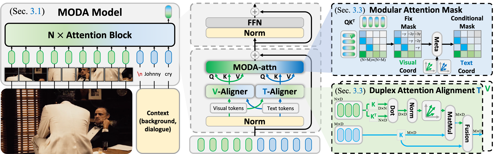

    
    <h1>MODA: MOdular Duplex Attention for  Multimodal Perception, Cognition, and Emotion Understanding</h1>

    <a href="https://zzcheng.top/" target="_blank">Zhicheng Zhang</a>1,2,†,

    Wuyou Xia1,

    Chenxi Zhao1,†,

    Yan Zhou3,

    Xiaoqiang Liu3,

    <a href="https://yongjie-zhu.github.io/" target="_blank">Yongjie Zhu</a>3,‡,

    Wenyu Qin3,

    <a href="https://scholar.google.com/citations?user=P6MraaYAAAAJ&hl=en/" target="_blank">Pengfei Wan</a>3,

    Di Zhang3,

    <a href="https://cv.nankai.edu.cn/" target="_blank">Jufeng Yang</a>1,2,✉

1Nankai University&nbsp;&nbsp;&nbsp;&nbsp;&nbsp;
2Pengcheng Laboratory&nbsp;&nbsp;&nbsp;&nbsp;&nbsp;
3Kuaishou Technology&nbsp;&nbsp;&nbsp;&nbsp;&nbsp;

†Work done at KlingAI&nbsp;&nbsp;&nbsp;&nbsp;&nbsp;
            ‡Project Leader&nbsp;&nbsp;&nbsp;&nbsp;&nbsp;
            ✉Corresponding Author&nbsp;&nbsp;&nbsp;&nbsp;&nbsp;

**🎉 Accepted by [ICML 2025 Spotlight](hhttps://icml.cc/virtual/2025/poster/46210) 🎉**

[📃 [Paper](https://arxiv.org/abs/2507.04635) ]
[📦 [Code](https://github.com/KwaiVGI/MODA) ]
[⚒️ [Project](https://zzcheng.top/MODA) ]
[📅 [Slide](https://zzcheng.top/assets/pdf/2025_ICML_MODA_slide.pdf) ]
<!-- [📊 [Poster](https://zzcheng.top/assets/pdf/2024_CVPR_ExtDM_poster.pdf) ] -->
<!-- [📃 [中译版](https://zzcheng.top/assets/pdf/2024_CVPR_ExtDM_chinese.pdf) ] -->
<!-- [🎞️ [Video](https://www.bilibili.com/video/BV1dC411E72q) / [YouTube](https://www.youtube.com/watch?v=1hxOUagr8mM) ] -->

> **TL;DR**: We i) identify attention deficit disorder as a critical barrier hindering fine-grained content understanding in MLLMs; ii) introduce a modular duplex attention mechanism to mitigate modality bias and enhance attention score justification; and iii) develop MODA-based MLLMs that enable fine-grained multimodal understanding across perception, cognition, and emotion tasks.

## 📈 1. News

- 🔥2024-07-10: Creating repository. The code is uploading ...
- 2024-05-01: MODA has been accepted to ICML 2025！